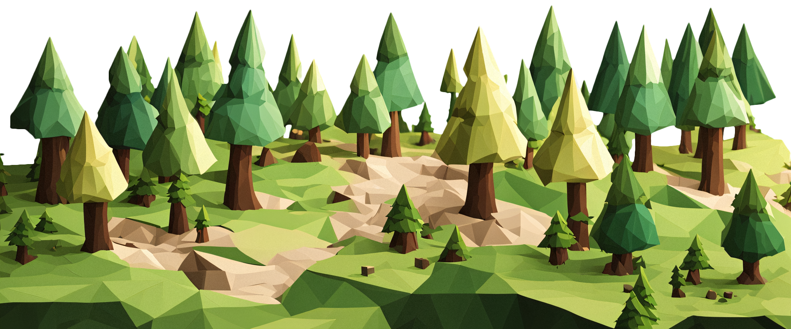

# Woodcutters



## Einleitung

**Woodcutters** ist ein browserbasiertes Planspiel, das sich auf politische Bildung konzentriert. 
Planspiele sind lernorientierte Spiele, die dabei helfen, komplexe Zusammenhänge 
in den Bereichen Politik, Wirtschaft und Umwelt zu verstehen.

In **Woodcutters** übernehmen die Spieler die Rolle von Holzfällerunternehmen mit dem Ziel, 
möglichst viel Holz für ihre Produktion zu sammeln. 
Schnell wird klar, dass es konkurrierende Firmen gibt, die ebenfalls möglichst viel Holz beanspruchen wollen.
Ein rein auf Maximierung ausgerichtetes Vorgehen hat jedoch keine hohe Gewinnwahrscheinlichkeit.
Der Wald erneuert sich nur langsam, weshalb die Spieler gemeinsam überlegen müssen
, wie sie den Wald nachhaltig nutzen können und welche Regeln sie dafür aufstellen wollen.

Weitere Spiele dieser Art sind auf der Seite der
[Bundeszentrale für politische Bildung](https://www.bpb.de/lernen/angebote/planspiele/datenbank-planspiele/)
zu finden.

## Spielen

### Variante 1: Direkt im Browser spielen

Du kannst das Spiel unter [https://woodcutters.mathia.xyz/](https://woodcutters.mathia.xyz/) spielen.

### Variante 2: Eigenen Server hosten

#### Voraussetzungen

- Node.js
- npm
- git

#### Installation

1. Repository klonen:

    ```bash
    git clone https://github.com/LeTammo/woodcutters.git
    ```

2. In das Client-Verzeichnis wechseln und installieren:

    ```bash
    cd woodcutters/client
    npm install
    npm run build
    ```

3. In das Server-Verzeichnis wechseln, installieren und den Server starten:

    ```bash
    cd ../server
    npm install
    npm start
    ```

---

Viel Spaß beim Spielen!
